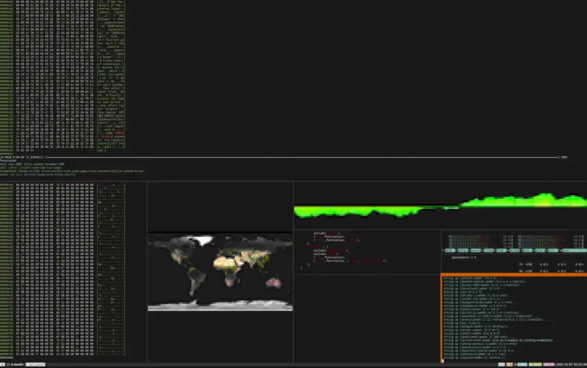

# 🎬 Hollywood: Director's Cut

```text
 ┌──────────────────────────────────────────────────┐
 │  HOLLYWOOD: DIRECTOR'S CUT                       │
 ├─────────────┬─────────────┬──────────────────────┤
 │ SCENE: ∞    │ TAKE: 1     │ ROLL: /dev/urandom   │
 ├─────────────┴─────────────┴──────────────────────┤
 │ DIRECTOR: you         CAMERA: tmux               │
 └──────────────────────────────────────────────────┘
```

*The terminal that makes you look like you are [hacking the Gibson](https://en.wikipedia.org/wiki/Hackers_%28film%29). Re-edited. No studio notes.*

*🎟️ Rated T for Terminal. Contains falling green letters and mild technobabble.*

*🦖 Bystanders will say: ["It's a UNIX system, I know this!"](https://www.youtube.com/watch?v=JOeY07qKU9c)*

[Hollywood](https://github.com/dustinkirkland/hollywood) fills your terminal with busy technobabble: `htop` here,
falling green letters there, a world map for good measure. The Director's Cut is the same movie in a container, with
the footage re-edited so that it looks better on your screen.

The original script is by Dustin Kirkland. This cut is a new edit of it.



*🎞️ The trailer: thirty seconds of the Director's Cut.*

## 🍿 Now showing

```sh
docker run -it --rm mapitman/hollywood-directors-cut
```

The image is also published under its old name, `mapitman/hollywood`. Both names are the same image, so old
commands keep working.

The image runs on both Intel and AMD machines (`linux/amd64`) and on Apple Silicon and other ARM machines
(`linux/arm64`). Docker picks the right one for your machine.

> 🎬 **Only four panes on a Mac?** Docker on a Mac runs inside a virtual machine, and the number of panes is limited to
> two per CPU that the machine has. Colima starts with 2 CPUs, which gives at most 4 panes. To give it more, run
> `colima stop` and then `colima start --cpu 8`. In Docker Desktop, change the CPU setting under Settings, then
> Resources. To see how many CPUs the container gets, run `docker run --rm debian:trixie-slim nproc`.

To leave the theater, press `<ctrl> - c` until the panes stop spawning, then press `<ctrl> - d` to exit the
container. You can also stop it from another terminal with `docker stop hollywood` (when you started it with
`--name hollywood`).

When Hollywood exits, the entrypoint resets your terminal: it shows the cursor, leaves the alternate screen and
turns off mouse reporting. This also happens after `docker stop`. It cannot happen after `docker kill`, because
Docker ends the container with no chance to clean up. If your cursor is missing after `docker kill`, run `reset`
(or `tput cnorm`).

## ✨ What is new in the Director's Cut

The original runs. This cut runs better.

- 🖥️ **It fits your screen.** The size of your terminal sets the most panes you can get, each layout picks a random number up to that
  maximum, and an even number of panes are all the same size. The original makes two panes per CPU, which is 16 panes on an 8-CPU machine.
- ⏱️ **Every pane has its own schedule.** Each pane changes its widget at its own time, 30 to 45 seconds after the
  last change, and no two panes show the same widget. Every 5 minutes the whole window is cut again with a new
  layout and a new number of panes.
- 🎨 **A new look for the pictures.** The sound wave, the wallpapers and the world map are drawn in color with half
  blocks, so every cell shows two pixels. There are no random letters and nothing scrolls. The image brings 171
  wallpapers, from the KDE Plasma set.
- 💺 **No bad seats.** A widget that needs more room than its pane has is swapped for one that fits.
- 📌 **A fixed set.** The base is Debian 13 (stable), and Hollywood 1.25 comes from a pinned upstream commit. All 21
  widgets work.
- 🧹 **It cleans up.** Your terminal is reset when the show ends, and Byobu never asks about ctrl-a.
- 📊 **One more widget.** `btop` joins the cast. It shows the CPU, memory, network and processes, and it shrinks to just
  the CPU box when its pane is small.

The details are in "Behind the scenes". The reasons are in "Director's commentary".

## 🎭 The cast

Hollywood opens a tmux session and fills it with panes. Each pane runs one widget, which wraps an ordinary tool.
There are 21 widgets. All of them play themselves.

| Widget | Shows |
|---|---|
| `apg` | random passwords from `/dev/urandom`, colored with `ccze` |
| `atop` | system and process monitor (needs 60 x 24) |
| `bat` | random source files from `/usr`, syntax highlighted with `batcat` |
| `bmon` | network bandwidth monitor (needs 48 x 26, or 141 x 18) |
| `btop` | resource monitor with CPU, memory, network and process boxes (needs 60 x 8, see "The btop widget") |
| `cmatrix` | falling green characters, as in The Matrix |
| `code` | random C, C++, Java and Python files, highlighted with `pygmentize` |
| `errno` | the list of error codes, in random order |
| `figlet` | large ASCII words such as ACCESS GRANTED (needs 57 x 7) |
| `hexdump` | hex dumps of programs in `/usr/bin` |
| `htop` | interactive process viewer |
| `jp2a` | wallpaper photos in 256 colors, drawn with half blocks (see "Wallpapers") |
| `logs` | log files under `/var/log` |
| `man` | random man pages |
| `map` | a map of the world in 256 colors, drawn once with half blocks (see "Wallpapers") |
| `mplayer` | a sound-wave video in true color, drawn with half-block characters (see "The mplayer widget") |
| `pv` | a fake file-transfer progress bar |
| `speedometer` | network throughput graph |
| `sshart` | random `ssh-keygen` key art (needs 20 x 12) |
| `stat` | file details for random paths under `/sys` and `/dev` |
| `tree` | directory trees under `/sys` and `/dev` |

The Debian slim image removes man pages and documentation. The Dockerfile puts them back so the `man` and `code`
widgets have something to show.

## 📝 Production notes

Every setting is an environment variable, because even directors take notes.

| Setting | Environment variable | Default |
|---|---|---|
| Cells per pane (this sets the maximum pane count) | `HOLLYWOOD_CELLS_PER_PANE` | `1400` |
| Pick a random pane count up to the maximum, at the start and at every rebuild (`0` always uses the maximum) | `HOLLYWOOD_RANDOM_PANES` | `1` |
| Minimum seconds a pane keeps a widget (the maximum is 1.5 times this) | `HOLLYWOOD_DELAY` | `30` |
| Seconds between layout rebuilds (`0` turns the rebuild off) | `HOLLYWOOD_REBUILD` | `300` |
| Playback speed of the `mplayer` widget (`0.5` is calmer, `1` is normal speed) | `HOLLYWOOD_MPLAYER_SPEED` | `0.75` |
| Crop filter for the `mplayer` widget (`scale` shows the whole video) | `HOLLYWOOD_MPLAYER_FILTERS` | `crop=128:64:0:16` |
| Seconds the `jp2a` widget shows each picture | `HOLLYWOOD_IMAGE_SECONDS` | `3` |
| Milliseconds between updates of the `btop` widget (`btop` accepts 100 or more) | `HOLLYWOOD_BTOP_UPDATE_MS` | `100` |

```sh
docker run -it --rm -e HOLLYWOOD_CELLS_PER_PANE=1000 -e HOLLYWOOD_DELAY=60 mapitman/hollywood-directors-cut
```

The `-s` (panes) and `-d` (minimum seconds a pane keeps a widget) options override the computed values:

```sh
docker run -it --rm mapitman/hollywood-directors-cut -s 6 -d 60
```

To find your terminal size, run `stty size` (it prints rows, then columns).

## 🎞️ Behind the scenes

How the movie gets made.

### Pane count and widget time

The entrypoint script sizes the number of panes to your terminal. Docker passes the terminal size in character
cells, so the script divides the cell count by 1400. The result is the maximum number of panes. It is limited to two panes
per CPU and to the number of widgets. The script `pane-count.sh` picks a random number of panes from 2 up to that maximum, so some layouts
have fewer and larger panes, and the widgets that need a big pane can run. A 161x37 terminal (a full-screen terminal
at 1920x1080 with a typical font) has a maximum of 4 panes. Set `HOLLYWOOD_RANDOM_PANES=0` to always use the maximum.

The CPU limit counts the CPUs that the container can see, not the CPUs of your computer. On Linux the two numbers are
the same. On a Mac, Docker runs in a virtual machine, so the container sees only the CPUs that the virtual machine has.

Each pane keeps its widget for 30 to 45 seconds, then swaps in another unused widget. Every pane picks its own time,
so the panes change at different moments. Every 5 minutes the window is rebuilt: one pane stays, the others are
replaced, a new number of panes is picked, and the panes are laid out again at random.

### Same-size panes

When the pane count is even, every pane has the same size, give or take one cell for the borders. `even-layout.sh`
arranges the panes in a grid of columns by rows. It picks the grid whose panes are closest to 2.5 times wider than
tall, which looks about square in a terminal. For example, 4 panes make a 2 by 2 grid, 6 make 3 columns by 2 rows,
and 8 make 4 columns by 2 rows. The grid is rebuilt every time the launcher rebuilds the window. An odd pane count
keeps the random layout.

### Widget size guard

Some widgets stop working in a small pane. The image runs every widget through a guard script (`widget-guard.sh`).
The guard checks the pane size when the widget starts and again after every resize. If the pane is too small, the
guard stops the widget and starts a different one that fits.

| Widget | Minimum columns x rows |
|---|---|
| `atop` | 60 x 24 |
| `bmon` | 48 x 26, or 141 x 18 (it asks you to enlarge the window below this) |
| `btop` | 60 x 8 (all four boxes need 80 x 24) |
| `figlet` | 57 x 7 |
| `sshart` | 20 x 12 |

All other widgets run in any pane size. To change a minimum or add a widget, edit the `MIN_` tables and the
`min_rows` function at the top of `widget-guard.sh`.

With the default settings on a 161x37 terminal, no pane is 24 rows tall, so `atop` never runs there.

### No repeated widgets

No two panes run the same widget. Each running widget holds a claim in `/tmp/hollywood-claims`, and a pane that
starts or switches picks a widget that nobody else holds. If no unused widget fits in a new pane, the pane closes
instead of repeating a widget. This only happens with many small panes (for example, 16 panes on a 320x90
terminal). When a pane is ready to swap and no other widget is free, it keeps its current widget.

### The btop widget

Hollywood has no `btop` widget, so the image adds one (`btop-widget.sh`). `btop` shows four boxes: the CPU, the
memory, the network and the processes. All four need a pane of at least 80 columns by 24 lines. A smaller pane
gets only the CPU box, which fits down to 60 columns by 8 lines. At 161 x 37 the panes are about 80 x 17, so
they show the CPU box. `btop` updates every 2000 ms by default, and the widget sets 100 ms, the fastest that `btop` allows, so the graphs
move smoothly.

The widget picks the boxes from the pane size when it starts. If you resize the pane across the 80 x 24 edge, it
starts `btop` again with the boxes that fit. When the widget guard stops it, the widget puts your terminal back the
way it was, because `btop` does not do that itself.

To run just this widget:

```sh
docker run -it --rm --entrypoint /opt/hollywood/lib/hollywood/btop mapitman/hollywood-directors-cut
```

Press `q` to leave `btop`. The widget then starts it again, so press ctrl-c to stop the widget.

### The mplayer widget

The image replaces Hollywood's `mplayer` widget with two small files, `mplayer-widget.sh` and
`soundwave-render.py`.

The video is a pre-rendered animation of an audio waveform. It has no sound track. The widget asks `mplayer` to crop
the video to the rows where the waveform is, scale it to your pane, and send the raw frames to the renderer. The
renderer draws each terminal cell as a half block, so every cell shows two pixels in true color. When the pane
changes size, the widget starts again at the new size. A pane with an odd width leaves its last column empty.

To run just this widget:

```sh
docker run -it --rm --entrypoint /opt/hollywood/lib/hollywood/mplayer mapitman/hollywood-directors-cut
```

Press ctrl-c to stop it. Run `reset` afterward if your cursor stays hidden.

### Wallpapers

The `jp2a` widget shows every JPEG it finds under `/usr`, one after another, except the map picture, which the `map`
widget shows. The image adds the 171 wallpaper photos from Debian's `plasma-workspace-wallpapers` package (the KDE
Plasma wallpapers) in `/usr/share/wallpapers`. The package's copyright file is in
`/usr/share/doc/plasma-workspace-wallpapers/copyright`, and Debian lists the wallpapers as GPL-2+.

The image replaces Hollywood's `jp2a` and `map` widgets. `image-widget.sh` is the `jp2a` widget, `map-widget.sh` is
the `map` widget, and both draw with `image-render.py`. Each picture is scaled to your pane and drawn with half
blocks in the 256-color palette, so every terminal cell shows two pixels. The picture keeps its shape and sits in
the middle of the pane, with black bars where the shapes differ. The `jp2a` widget keeps each picture for 3 seconds.
The `map` widget draws the map once. A pane of 120 x 36 cells has only 120 x 72 pixels, so the pictures are blocky.
When the pane changes size, the widgets draw the picture again.

The widget never needs more than a few hundred columns of pixels, so the build shrinks the big photos with
`shrink-jpeg.sh`: photos 3000 pixels wide or more to a quarter of their size, and photos 1500 pixels wide or more to
half. That cuts the wallpapers from about 95 MB to 23 MB. The build fails if fewer than 150 wallpapers are
installed.

To run just one of these widgets, use `jp2a` or `map` as the last part of the path:

```sh
docker run -it --rm --entrypoint /opt/hollywood/lib/hollywood/jp2a mapitman/hollywood-directors-cut
docker run -it --rm --entrypoint /opt/hollywood/lib/hollywood/map mapitman/hollywood-directors-cut
```

### Patch to Hollywood

The Docker build applies one patch, and the patch must match Hollywood's code exactly. If a new Hollywood changes
the code around the patch, the build fails, so a broken launcher can never end up in the image.

- `launcher.patch`: the Hollywood launcher picks one random pane for each split. When tmux refuses the split because
  that pane is too small, the launcher does not retry, so you get fewer panes than requested. The patch makes the
  launcher try every pane in random order, in both directions, until one has room. After the launcher builds the
  panes, the patch also runs `even-layout.sh`, which gives an even number of panes the same size. At every rebuild, the patch
  asks `pane-count.sh` for a new pane count. The patch also adds
  a notice to the launcher that says it was modified, as the Apache License asks.

### Byobu ctrl-a

Byobu asks which mode ctrl-a should use the first time you press it. The image answers that question when it is
built. Ctrl-a is the GNU Screen prefix (option 1), so you never see the question.

### Build and run locally

```sh
just build
just run
```

`just build` tags the image with both of its names, `mapitman/hollywood-directors-cut` and `mapitman/hollywood`.
`just run` names the container `hollywood`, so you can stop it with `docker stop hollywood`.

## 🎙️ Director's commentary

Why each scene was cut the way it was. Each change has a reason.

- **Debian stable base.** `debian:trixie-slim` is a named release, so the base does not change between builds
  except for security fixes. It has every tool the widgets need, including `mplayer`.
- **Hollywood from the upstream source.** The Dockerfile fetches the commit tagged `1.25` (`4bfa297`), so the
  Hollywood scripts do not change between builds. This version has all 21 widgets. Its launcher passes the values of
  `-s` and `-d` to its own tmux session, which the entrypoint needs. Its `sshart` widget works with current OpenSSH.
- **Pane count from terminal size.** Hollywood defaults to two panes per CPU. On an 8-CPU machine that is
  16 panes, which are too small to read on a 1920x1080 screen. The entrypoint sizes the count to the terminal.
- **30 to 45 seconds per widget.** Hollywood replaces every pane every 10 seconds by default. That is not long
  enough to see what is happening in each widget. Some examples:
  - The `bmon` graph covers 60 seconds of history, so a pane that lasts 10 seconds shows only the first sixth of it.
    A pane that lasts 30 to 45 seconds shows at least half.
  - The `code` widget shows each file for 2 seconds and the `bat` widget for 3, so 10 seconds is only a few files.
- **Panes change one at a time.** Hollywood replaces all panes at the same moment, so you cannot finish reading one
  before it disappears. The widget guard gives each pane its own random time between the delay and 1.5 times the
  delay, then swaps the widget inside the pane. Swapping does not rebuild the window. The launcher's own refresh now
  runs only every 5 minutes, so the pane layout still changes now and then.
- **Launcher patch.** The launcher picks one random pane per split and never retries. When that pane was too small,
  tmux refused the split and the window ended up with fewer panes than requested. At 161x37, 2 of 8 launches gave
  3 panes instead of 4.
- **Widget size guard.** Some widgets keep running in a pane that is too small and show a message instead of
  content: `atop` asks for 60 x 24, and `bmon` asks you to enlarge the window. At 161x37 the largest panes are
  18 rows tall. A pane also shrinks while the launcher splits later panes, so the guard checks again on every resize.
- **No repeated widgets.** The launcher picks the first widget separately from the rest, so two panes can start
  with the same widget. The guard keeps one widget per pane, both at the start and when panes swap.
- **Wallpapers and a new viewer for the `jp2a` widget.** The image had one JPEG of its own, so the widget showed
  the same picture over and over. Debian has no wallpaper package with many JPEGs except the KDE Plasma one, which
  has 171. Hollywood's `jp2a` widget also draws each picture as letters in the eight basic terminal colors and
  changes pictures twice a second, which is too fast to see them. The new viewer draws each picture in 256 colors
  with half blocks, the same way as the new `mplayer` widget, and keeps it for 3 seconds. The `map` widget printed
  its picture again every second, so its pane scrolled all the time. It now draws the map once with the same viewer.
- **A `btop` widget.** Hollywood has no widget for `btop`, a monitor that looks more modern than `htop` and `atop`.
  `btop` needs 80 x 24 for its four boxes, and the panes of a 1080p screen are about 80 x 17, so a plain `btop` would
  almost never fit. With only the CPU box it fits in 60 x 8, so the widget shows that box in small panes and all
  four boxes in big ones. It also updates twenty times as fast as `btop` does by default: every 100 ms, the fastest that `btop` allows, and
  not every 2000 ms. Counting tmux, which draws the faster updates, that costs about 3% of one core in a normal pane and 11% in a
  very large one, and 6 MB of memory.
- **A new `mplayer` widget.** Hollywood plays the sound-wave video at 100 times normal speed. In a 100 x 18 pane
  that redraws the terminal about 950 times a second, which flickers. It also draws the video with libcaca, which
  puts a random-looking letter on every cell, and the letters change on every frame. libcaca has no setting for
  that. The waveform covers only a thin band across the middle of the video, so the top and bottom of the pane stay
  black, and in quiet passages only the center line shows. The new widget crops the video to the waveform, scales it
  to the pane, and draws it in true color with half blocks. The picture has no letters and no screen wipe. In
  testing, it used about 20% of one core in a 161 x 37 pane and about 36% of one core in a 237 x 61 pane.
- **Same-size panes.** Random splits left panes at uneven sizes, such as 80 x 18, 80 x 9 and 161 x 8 in the same
  window. With an even pane count the layout is now an even grid.
- **Byobu ctrl-a answered at build time.** The first ctrl-a in a pane opened a question about the ctrl-a mode.
  The image picks the GNU Screen mode so the question never appears.
- **Terminal reset on exit.** `cmatrix` and `mplayer` hide the cursor, switch to the alternate screen and turn on
  mouse reporting. They cannot undo this when the container stops, so the terminal had no cursor afterward.
- **Man pages and docs restored.** The slim image removes them, and the `man` and `code` widgets need them.
- **Two image names.** The project is now called Hollywood: Director's Cut, so the image is
  `mapitman/hollywood-directors-cut`. Docker Hub has no alias feature, so the same image is also published as
  `mapitman/hollywood`, and commands that use the old name keep working.

## 🏆 Credits

Written by Dustin Kirkland. Re-edited by Mark Pitman. Wallpapers from the KDE Plasma set, by way of Debian. No
terminals were harmed in the making of this image. 🎬

The files in this repository are licensed under the MIT license (see `LICENSE`). Hollywood is licensed under the
Apache License 2.0 (Copyright 2014 Dustin Kirkland), and the wallpapers are GPL-2+. `THIRD-PARTY.md` lists each part
that comes from another project, its license, and what this project changed. The image carries the same files in
`/usr/share/doc/hollywood`.
